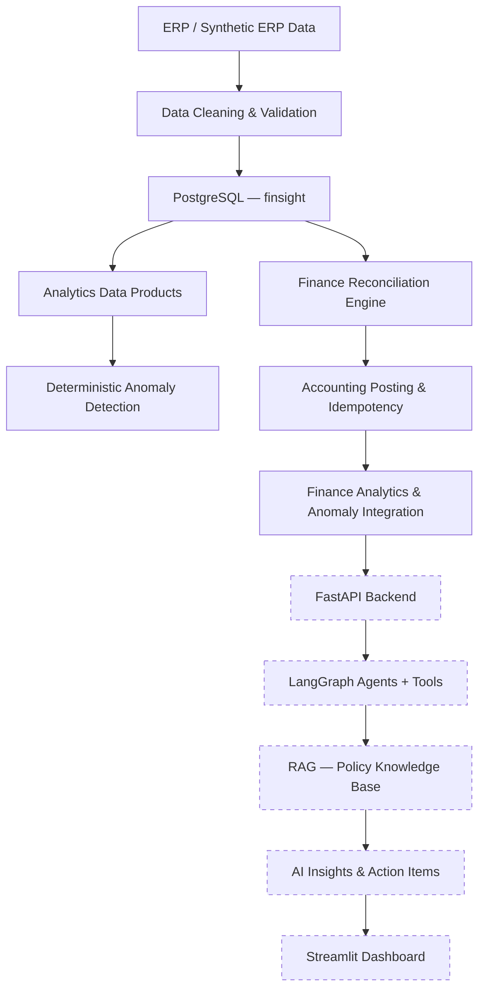
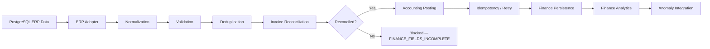
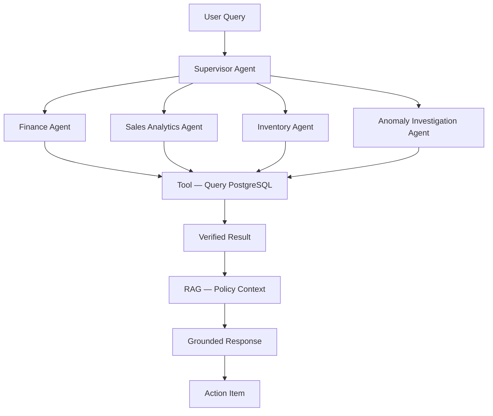
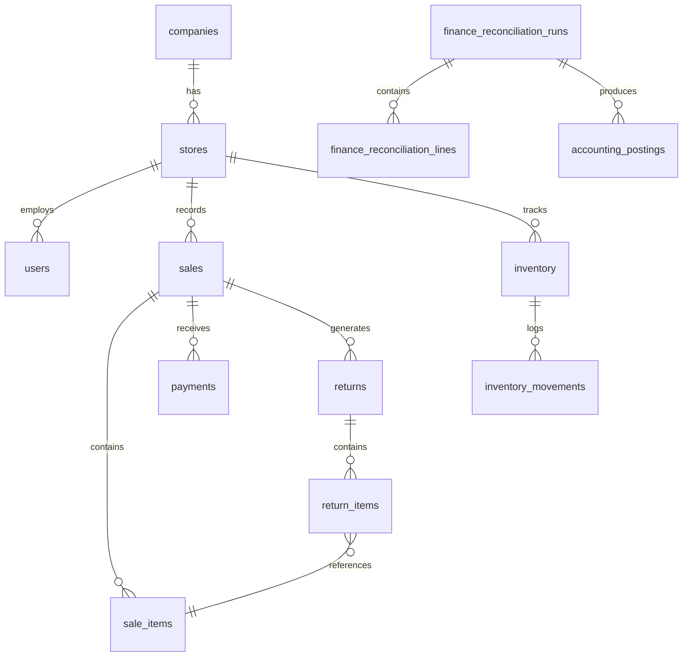

# FinSight

**An agentic finance and retail operations intelligence platform that connects ERP data, deterministic financial reconciliation, anomaly detection, and grounded AI workflows.**


---

## The Problem

Retail and finance teams generate large volumes of operational data across sales, inventory, payments, returns, and expenses. The challenge is not simply asking an AI a question — it is building a system where:

- ERP data is validated and cleaned before it enters any calculation
- Financial reconciliation is deterministic and auditable
- Anomalies are detected by rules, not guesses
- AI reasoning is grounded in verified database results, not invented numbers

FinSight is built around this principle: **deterministic calculations first, AI reasoning second.**

---

## Why FinSight Is Different

| Approach | How it works |
|---|---|
| Traditional analytics | Database → dashboards |
| Generic AI chatbot | User → LLM → answer |
| **FinSight** | ERP → validated data → reconciliation → anomaly detection → tool-based AI → grounded response |

LLMs in FinSight are **not** the source of truth for financial numbers. They query verified tools, retrieve policy context through RAG, and explain results that have already been calculated deterministically.

---

## Architecture

### High-Level System



> Solid nodes are **implemented**. Dashed nodes are **planned**.

---

### Finance Reconciliation Flow



---

### Planned AI Flow



---

### Database Relationships



---

## Current Implementation Status

### Completed

| Component | Detail |
|---|---|
| PostgreSQL schema | 33 tables: operational, analytics, finance, AI |
| ERP dataset | Synthetic retail dataset — 5 stores, 1,000 customers, 240 products |
| Data cleaning | Duplicate invoice `INV-000151` identified and removed from processed data |
| Operational loading | 5,000 sales, 15,067 sale items, 350 returns, 4,854 payments |
| Data products | `daily_store_metrics`, `product_performance`, `customer_metrics`, `inventory_metrics` |
| Anomaly detection | 32 `SALES_SPIKE`, 23 `LOW_STOCK_WITH_DEMAND` — deterministic rule-based |
| Finance engine | Decimal arithmetic, money parsing, date normalization, validation, deduplication |
| Finance reconciliation | 4,854 sales reconciled; 350 returns blocked (missing tax fields) |
| ERP adapter | Read-only; preserves all source IDs; no ERP data modified |
| Finance persistence | Runs, lines, and postings persisted to PostgreSQL |
| Accounting posting | Mock client; 4,854 posted; retry + idempotency verified |
| Finance analytics | Reconciliation by store/date, blocked returns, posting status |
| Finance anomaly integration | 350 `FINANCE_FIELDS_INCOMPLETE` anomalies; idempotent re-runs |
| Test suite | **34 tests passed, 0 failures** |

### Planned

| Component | Phase |
|---|---|
| FastAPI backend | Phase 6 — next |
| RAG policy knowledge base | Phase 7 |
| LangGraph agents | Phase 8 |
| AI insights and action items | Phase 9 |
| Streamlit dashboard | Phase 10 |

---

## Real Project Numbers

| Metric | Value |
|---|---|
| Stores | 5 |
| Customers | 1,000 |
| Products | 240 |
| Cleaned sales | 5,000 |
| Sale items | 15,067 |
| Returns | 350 |
| Normalized finance lines | 14,985 |
| Reconciled invoices | 4,854 |
| Blocked return groups | 350 |
| Accounting postings | 4,854 (all POSTED) |
| Total anomalies | 405 |
| Tests | 34 passed, 0 failed |

---

## Finance Engine

The finance reconciliation engine is the core of FinSight's deterministic layer.

**Key engineering decisions:**

- `Decimal` arithmetic throughout — no binary floating point
- Money quantized to 2 decimal places with `ROUND_HALF_UP`
- Accepts INR money formats: plain decimal, Indian grouping, `Rs.` prefix, parenthesized negatives, trailing-minus negatives
- Date normalization: `DD-MM-YYYY`, `DD/MM/YYYY`, `YYYY-MM-DD`
- Duplicate line detection: identical duplicates are deduplicated; conflicting duplicates are rejected
- Invoice-level validation: partial invoices are never posted
- Reconciliation tolerance: `0.05 × number_of_lines`
- Accounting API: 201 success, 409 idempotent success, 422 permanent failure, 500/503/timeout retryable — max 3 attempts
- Idempotency key: invoice number, reused across retries
- Ledger and journal writes use `os.replace` for crash safety

> **Principle:** Financial correctness is deterministic. AI is used for investigation and reasoning around verified results — never for calculating financial numbers.

---

## Data Quality

Raw source data is **never silently modified**.

- Raw files are preserved under `data/.../raw/`
- Processed files are created separately under `data/.../processed/`
- Duplicate invoice `INV-000151` was identified in the source and removed from the processed dataset only
- A product/category mismatch (Classic Shampoo 009 categorized as Electronics) was documented as a source data quality issue — not silently corrected
- All data quality decisions are auditable and reproducible

---

## A Real-World Scenario

> A store generates an unusual sales spike on a given day.

1. **Anomaly detection** identifies the spike deterministically (daily sales > 2× store average)
2. **Finance reconciliation** confirms the invoices are reconciled and posted
3. **Finance analytics** shows the reconciled amount by store and date
4. *(Planned)* **FastAPI** exposes the anomaly and finance data to the AI layer
5. *(Planned)* **Finance Agent** queries the verified database results via tools
6. *(Planned)* **RAG** retrieves the relevant business policy
7. *(Planned)* **AI** explains the anomaly with grounded evidence
8. *(Planned)* **Action item** is created for review

---

## Technology Choices

| Decision | Choice | Why |
|---|---|---|
| Database | PostgreSQL | Relational integrity, constraints, transactions, SQL aggregation — essential for financial data |
| ORM / DB access | psycopg2 (direct) | Full control over queries; no ORM abstraction hiding financial logic |
| Finance arithmetic | Python `Decimal` | Exact decimal arithmetic; binary float is unsuitable for money |
| API framework | FastAPI *(planned)* | Async, Pydantic validation, automatic OpenAPI docs |
| Agent framework | LangGraph *(planned)* | Explicit graph-based control flow; agents must not hallucinate financial numbers |
| Policy retrieval | RAG *(planned)* | Policies belong in documents, not hardcoded prompts |
| Dashboard | Streamlit *(planned)* | Fast analytics UI; consumes FastAPI rather than implementing business logic |
| Accounting integration | Mock client (current) | Idempotency and retry logic verified without depending on a real external API |

---

## Quick Start

```bash
# 1. Clone
git clone https://github.com/OjusGupta/Finsight.git
cd Finsight

# 2. Virtual environment
python -m venv .venv
.venv\Scripts\activate        # Windows
# source .venv/bin/activate   # macOS/Linux

# 3. Install dependencies
pip install -r requirements.txt

# 4. Configure environment
cp .env.example .env
# Edit .env with your PostgreSQL credentials

# 5. Create the database
# In psql or pgAdmin: CREATE DATABASE finsight;

# 6. Run schema migrations
# In psql: \i database/schema/001_initial_schema.sql
#          \i database/schema/002_finance_persistence.sql

# 7. Load reference and operational data
python scripts/seed_database.py
python scripts/load_remaining_database.py

# 8. Run the test suite
python -m pytest tests/ -v
```

> The finance engine CLI (`pipeline.py`) runs independently of PostgreSQL and requires `--lines`, `--customers`, and `--run-date` arguments. See [docs/13_finance_reconciliation_engine.md](docs/13_finance_reconciliation_engine.md).

---

## Design Principles

1. PostgreSQL is the source of truth.
2. Financial calculations are deterministic — SQL and Python rules, not LLMs.
3. Raw source data is never silently modified.
4. AI responses must be grounded in tool/database results.
5. Idempotency matters for every financial operation.
6. Every anomaly must be traceable to its source record.
7. Business logic belongs in services, not in routes or UI.
8. Planned components are clearly labelled as planned.

---

## Roadmap

| Phase | Description | Status |
|---|---|---|
| 1–2 | Project foundation, ERP dataset, data pipeline | ✅ Complete |
| 3 | PostgreSQL schema and operational loading | ✅ Complete |
| 4 | Data products and anomaly detection | ✅ Complete |
| 5 (finance) | Finance reconciliation engine + ERP adapter | ✅ Complete |
| 5 (persistence) | Finance persistence + accounting posting | ✅ Complete |
| 5 (analytics) | Finance analytics + anomaly integration | ✅ Complete |
| **6** | **FastAPI backend** | 🔜 **Next** |
| 7 | RAG policy knowledge base | Planned |
| 8 | LangGraph agents | Planned |
| 9 | AI insights and action items | Planned |
| 10 | Streamlit dashboard | Planned |

---

## Repository Layout

```
finops/          Finance reconciliation engine (models, parsing, validation,
                 reconciliation, posting, persistence, analytics)
database/        Schema SQL, seed SQL, analytics query files
scripts/         Data cleaning and loading scripts
tests/           Test suite (34 tests)
data/            Raw, processed, reference, and quality CSV data
docs/            Project documentation (14 documents)
backend/         Planned FastAPI structure
ai/              Planned agents, tools, RAG, workflows
frontend/        Planned Streamlit pages and components
```

---

## Documentation

| Document | Purpose |
|---|---|
| [01 Project Overview](docs/01_project_overview.md) | Goals, scope, and context |
| [02 Architecture](docs/02_architecture.md) | Layer responsibilities and design decisions |
| [03 Database Design](docs/03_database_design.md) | Schema, relationships, and constraints |
| [04 Data Pipeline](docs/04_data_pipeline.md) | Raw → processed → database flow |
| [05 Data Quality](docs/05_data_quality_and_fixes.md) | Source issues identified and handled |
| [06 Data Products](docs/06_data_products.md) | Analytics tables and validation |
| [07 Database Loading](docs/07_database_loading.md) | Loader scripts and source mappings |
| [08 Verification](docs/08_verification_and_validation.md) | Reconciliation checks and validation results |
| [09 AI Agent Design](docs/09_ai_agent_design.md) | Planned agent architecture |
| [10 API Design](docs/10_api_design.md) | Planned FastAPI endpoint design |
| [11 Development Log](docs/11_development_log.md) | Phase-by-phase engineering diary |
| [12 Next Steps](docs/12_next_steps.md) | Current state and upcoming phases |
| [13 Finance Reconciliation Engine](docs/13_finance_reconciliation_engine.md) | Engine design, rules, and live results |
| [14 Finance Analytics](docs/14_phase5_finance_analytics.md) | Phase 5 analytics and anomaly integration |
