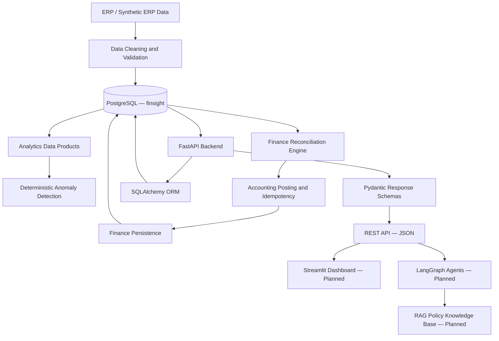
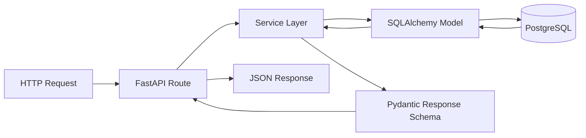
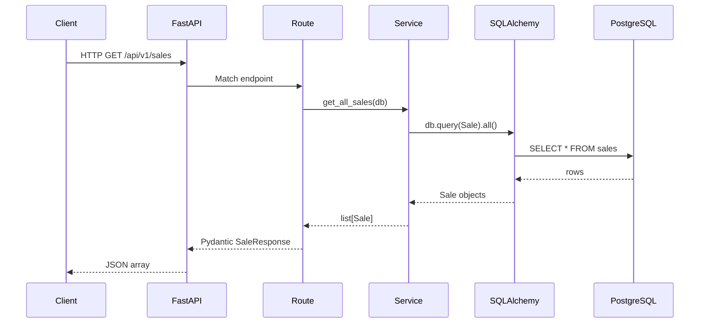
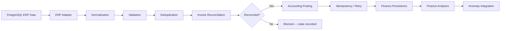
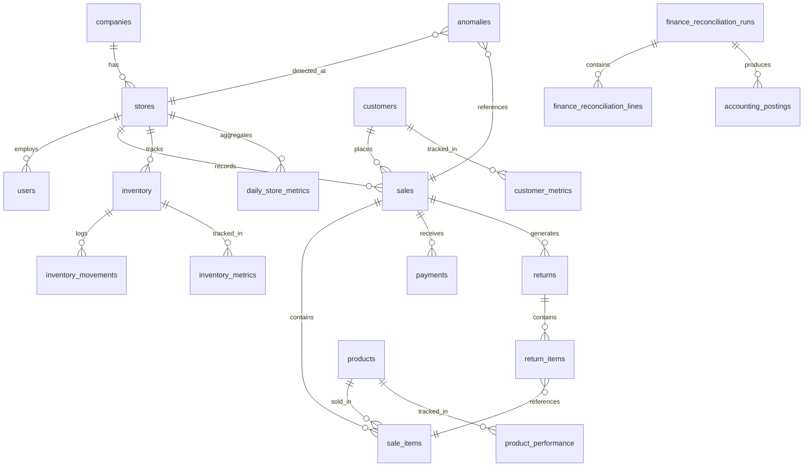

# FinSightAI

**FinSightAI is a financial analytics and operations intelligence platform that combines structured ERP-style business data, a PostgreSQL database, a deterministic finance reconciliation engine, a FastAPI REST backend, and a planned AI/RAG/agent layer for grounded decision support.**


---

## 1. Problem Statement

Retail and finance teams generate large volumes of operational data across sales, inventory, payments, returns, expenses, and customer activity. The challenge is not simply querying that data — it is building a system where:

- Raw ERP data is validated and cleaned before it enters any calculation
- Financial reconciliation is deterministic and auditable, not estimated by an LLM
- Anomalies are detected by explicit rules against verified database results
- A REST API exposes structured data to downstream consumers
- AI reasoning, when added, is grounded in tool-verified facts rather than invented numbers

FinSightAI is built around this principle: **deterministic data pipeline and API first, AI reasoning second.**

---

## 2. Key Features

### Implemented

**PostgreSQL database — 31 tables**
- Operational: companies, stores, users, customers, products, categories, suppliers, supplier_products, inventory, inventory_movements, sales, sale_items, payments, returns, return_items, refunds, expenses, login_events
- Analytics data products: daily_store_metrics, product_performance, customer_metrics, inventory_metrics
- Anomaly detection: anomalies table with rule-based detection (SALES_SPIKE, LOW_STOCK_WITH_DEMAND, FINANCE_FIELDS_INCOMPLETE, and others)
- Finance persistence: finance_reconciliation_runs, finance_reconciliation_lines, accounting_postings
- AI/action scaffolding: ai_insights, action_items, automation_runs, system_logs, audit_logs

**Finance reconciliation engine (`finops/`)**
- `Decimal` arithmetic throughout — no binary floating point for money
- Money parsing: plain decimal, Indian grouping, `Rs.` prefix, parenthesized negatives, trailing-minus negatives
- Date normalization: `DD-MM-YYYY`, `DD/MM/YYYY`, `YYYY-MM-DD`
- Duplicate line detection: identical duplicates deduplicated; conflicting duplicates rejected
- Invoice-level validation: partial invoices are never posted
- Reconciliation tolerance: `0.05 × number_of_lines`
- Accounting API client: 201 success, 409 idempotent success, 422 permanent failure, 500/503/timeout retryable — max 3 attempts
- Idempotency key per invoice, reused across retries
- Crash-safe ledger and journal writes using `os.replace`
- Full persistence to PostgreSQL: runs, lines, and postings

**FastAPI backend (`backend/`)**
- `GET /health` — service health check
- `GET /api/v1/stores` — all stores
- `GET /api/v1/sales` — all sales
- `GET /api/v1/products` — all products
- `GET /api/v1/customers` — all customers
- `GET /api/v1/inventory` — all inventory records
- `GET /api/v1/anomalies` — all detected anomalies
- `GET /api/v1/analytics/daily-store` — daily store metrics
- `GET /api/v1/analytics/product-performance` — product performance metrics
- `GET /api/v1/analytics/customer-metrics` — customer metrics
- `GET /api/v1/analytics/inventory-metrics` — inventory metrics
- SQLAlchemy ORM models for all served tables
- Pydantic response schemas with `from_attributes=True`
- `pydantic-settings` for environment-based configuration
- Dependency-injected `get_db()` session per request

**Anomaly detection**
- 32 `SALES_SPIKE` anomalies (daily sales > 2× store average)
- 23 `LOW_STOCK_WITH_DEMAND` anomalies
- 350 `FINANCE_FIELDS_INCOMPLETE` anomalies (returns missing tax fields)
- All anomalies are rule-based, deterministic, and traceable to source records
- Idempotent re-runs insert 0 duplicates

**Data pipeline**
- Synthetic ERP dataset: 5 stores, 1,000 customers, 240 products
- 5,000 cleaned sales, 15,067 sale items, 350 returns, 4,854 payments
- Duplicate invoice `INV-000151` identified and removed from processed data only — raw files preserved
- Product/category mismatch documented as a source data quality issue, not silently corrected

**Test suite**
- 34 tests, 5 subtests, 0 failures
- Covers: money parsing, date parsing, sign validation, deduplication, reconciliation tolerance, partial invoice rejection, API retry/idempotency, ERP adapter traceability, finance integration, PostgreSQL persistence (mocked)

### In Progress

- FastAPI routes for `payments`, `returns`, `refunds`, `expenses` — models and schemas exist but routes are not yet registered in `main.py`
- `backend/app/core/dependencies.py` — placeholder, not yet implemented
- `backend/app/core/security.py` — placeholder, not yet implemented
- `backend/app/routes/auth.py` — placeholder, not yet implemented
- `backend/app/services/auth_service.py` — placeholder, not yet implemented
- `backend/tests/` — test files exist but are empty
- Finance endpoint group (`/api/v1/finance/...`) — finance analytics data is in PostgreSQL but not yet exposed via FastAPI

### Planned

- Authentication and authorization (JWT or session-based)
- Pagination, filtering, and sorting on all list endpoints
- Finance API endpoints: reconciliation runs, blocked returns, posting status
- RAG policy knowledge base (Phase 7)
- LangGraph agent layer: supervisor, finance agent, sales agent, inventory agent, anomaly investigation agent (Phase 8)
- AI insights and action item generation grounded in verified database results (Phase 9)
- Streamlit dashboard consuming the FastAPI backend (Phase 10)

---

## 3. Architecture

### System Overview



> Components without "Planned" label are implemented. Planned components have directory scaffolding only.

---

### FastAPI Request Flow



---

### Request Lifecycle



---

### Finance Reconciliation Flow



---

## 4. Database Schema

31 tables across 5 logical groups.

| Group | Tables |
|---|---|
| Reference | companies, stores, users, categories, products, suppliers, supplier_products, customers |
| Operational | inventory, inventory_movements, sales, sale_items, payments, returns, return_items, refunds, expenses, login_events |
| Analytics | daily_store_metrics, product_performance, customer_metrics, inventory_metrics |
| Finance | finance_reconciliation_runs, finance_reconciliation_lines, accounting_postings |
| AI / Audit | anomalies, ai_insights, action_items, automation_runs, system_logs, audit_logs, raw_data_batches, raw_sales, data_quality_issues |



---

## 5. Technology Choices

| Decision | Choice | Reason |
|---|---|---|
| Database | PostgreSQL | Relational integrity, FK constraints, transactions, `NUMERIC` for money — essential for financial data |
| ORM | SQLAlchemy | Standard Python ORM; clean model-to-table mapping; works with FastAPI dependency injection |
| API framework | FastAPI | Async-capable, automatic OpenAPI docs, Pydantic integration, type-safe |
| Schema validation | Pydantic v2 | Strict type validation on API responses; `from_attributes=True` for ORM compatibility |
| Finance arithmetic | Python `Decimal` | Exact decimal arithmetic; binary float is unsuitable for money calculations |
| Direct DB access (finops) | psycopg2 | Finance engine predates the ORM layer; full control over queries; no abstraction hiding financial logic |
| Agent framework | LangGraph *(planned)* | Explicit graph-based control flow; agents must not hallucinate financial numbers |
| Policy retrieval | RAG *(planned)* | Business policies belong in documents, not hardcoded prompts |
| Dashboard | Streamlit *(planned)* | Fast analytics UI; consumes FastAPI rather than implementing business logic |

---

## 6. Project Metrics

| Metric | Value |
|---|---|
| Database tables | 31 |
| Stores | 5 |
| Customers | 1,000 |
| Products | 240 |
| Cleaned sales | 5,000 |
| Sale items | 15,067 |
| Returns | 350 |
| Payments | 4,854 |
| Reconciled invoices | 4,854 |
| Total anomalies | 405 |
| FastAPI endpoints | 11 |
| SQLAlchemy models | 10 |
| Pydantic schemas | 10 |
| Tests | 34 passed, 0 failed |

---

## 7. Quick Start

### Prerequisites

- Python 3.12
- PostgreSQL 15 running locally
- A database named `finsight` created in PostgreSQL

```bash
# 1. Clone
git clone https://github.com/OjusGupta/Finsight.git
cd Finsight

# 2. Virtual environment
python -m venv .venv
.venv\Scripts\activate        # Windows
# source .venv/bin/activate   # macOS/Linux

# 3. Install dependencies
pip install -r requirements.txt

# 4. Configure environment
cp .env.example .env
# Edit .env with your PostgreSQL credentials

# 5. Run schema migrations
# In psql: \i database/schema/001_initial_schema.sql
#          \i database/schema/002_finance_persistence.sql

# 6. Load reference and operational data
python scripts/seed_database.py
python scripts/load_remaining_database.py

# 7. Run the test suite
python -m pytest tests/ -v

# 8. Start the FastAPI server
uvicorn backend.app.main:app --reload
# API available at http://localhost:8000
# Swagger UI at http://localhost:8000/docs
```

### Environment Variables

Copy `.env.example` to `.env` and fill in your values. Never commit `.env`.

```
DB_HOST=localhost
DB_PORT=5432
DB_NAME=finsight
DB_USER=postgres
DB_PASSWORD=your_password_here
```

### Finance Engine CLI

The finance reconciliation engine runs independently of the FastAPI server:

```bash
python pipeline.py \
  --lines path/to/lines.csv \
  --customers path/to/customers.csv \
  --run-date 2026-09-24
```

---

## 8. API Reference

The FastAPI server exposes automatic interactive documentation at `/docs` (Swagger UI) and `/redoc`.

| Method | Endpoint | Description |
|---|---|---|
| GET | `/health` | Service health check |
| GET | `/api/v1/stores` | List all stores |
| GET | `/api/v1/sales` | List all sales |
| GET | `/api/v1/products` | List all products |
| GET | `/api/v1/customers` | List all customers |
| GET | `/api/v1/inventory` | List all inventory records |
| GET | `/api/v1/anomalies` | List all detected anomalies |
| GET | `/api/v1/analytics/daily-store` | Daily store metrics |
| GET | `/api/v1/analytics/product-performance` | Product performance metrics |
| GET | `/api/v1/analytics/customer-metrics` | Customer metrics |
| GET | `/api/v1/analytics/inventory-metrics` | Inventory metrics |

> Pagination, filtering, and sorting are planned for a future iteration.

---

## 9. Repository Layout

```
backend/            FastAPI application
  app/
    core/           Config (pydantic-settings), dependencies, security (placeholder)
    database/       SQLAlchemy engine, session factory, get_db() dependency
    models/         SQLAlchemy ORM models
    routes/         FastAPI route handlers
    schemas/        Pydantic response schemas
    services/       Business logic / database query layer

finops/             Finance reconciliation engine (pure Python, psycopg2)
  models.py         Dataclasses: NormalizedLine, InvoiceDocument, AccountingResponse
  parsing.py        Date and money parsing
  validation.py     Line-level validation rules
  deduplication.py  Duplicate line detection
  reconciliation.py Invoice-level reconciliation
  posting.py        PostingEngine with retry and idempotency
  accounting_client.py  AccountingClient interface
  mock_accounting.py    Mock client for testing
  erp_adapter.py    Read-only PostgreSQL ERP adapter
  postgres_persistence.py  Finance run/line/posting persistence
  finance_analytics.py     Analytics queries over finance tables
  phase4.py         Live pipeline entry point (ERP → reconcile → post → persist)
  phase5.py         Finance analytics and anomaly integration entry point
  pipeline.py       CLI entry point for CSV-based pipeline

database/
  schema/           001_initial_schema.sql, 002_finance_persistence.sql
  queries/          finance.sql (12 analytics queries), analytics.sql, sales.sql, inventory.sql
  seeds/            001_sample_data.sql

scripts/            Data loading and cleaning scripts
tests/              34-test suite (pure Python, no DB connection required)
data/               Raw, processed, reference, and quality CSV data
docs/               14 documentation files covering all phases
ai/                 Placeholder structure for future LangGraph agents and RAG
frontend/           Placeholder structure for future Streamlit dashboard
```

---

## 10. Design Principles

1. PostgreSQL is the source of truth.
2. Financial calculations are deterministic — SQL and Python `Decimal`, not LLMs.
3. Raw source data is never silently modified.
4. AI responses must be grounded in tool/database results, not generated numbers.
5. Idempotency matters for every financial operation.
6. Every anomaly must be traceable to its source record.
7. Business logic belongs in services, not in routes or UI.
8. Planned components are clearly labelled as planned.

---

## 11. Roadmap

| Phase | Description | Status |
|---|---|---|
| 1–2 | Project foundation, ERP dataset, data pipeline | ✅ Complete |
| 3 | PostgreSQL schema and operational data loading | ✅ Complete |
| 4 | Analytics data products and anomaly detection | ✅ Complete |
| 5 | Finance reconciliation engine, persistence, analytics | ✅ Complete |
| 6 | FastAPI backend — core endpoints live | ✅ Complete |
| 6+ | Auth, pagination, finance endpoints, backend tests | 🔄 In Progress |
| 7 | RAG policy knowledge base | Planned |
| 8 | LangGraph agents | Planned |
| 9 | AI insights and action items | Planned |
| 10 | Streamlit dashboard | Planned |

---

## 12. Documentation

| Document | Purpose |
|---|---|
| [01 Project Overview](docs/01_project_overview.md) | Goals, scope, and context |
| [02 Architecture](docs/02_architecture.md) | Layer responsibilities and design decisions |
| [03 Database Design](docs/03_database_design.md) | Schema, relationships, and constraints |
| [04 Data Pipeline](docs/04_data_pipeline.md) | Raw → processed → database flow |
| [05 Data Quality](docs/05_data_quality_and_fixes.md) | Source issues identified and handled |
| [06 Data Products](docs/06_data_products.md) | Analytics tables and validation |
| [07 Database Loading](docs/07_database_loading.md) | Loader scripts and source mappings |
| [08 Verification](docs/08_verification_and_validation.md) | Reconciliation checks and validation results |
| [09 AI Agent Design](docs/09_ai_agent_design.md) | Planned agent architecture |
| [10 API Design](docs/10_api_design.md) | FastAPI endpoint design |
| [11 Development Log](docs/11_development_log.md) | Phase-by-phase engineering diary |
| [12 Next Steps](docs/12_next_steps.md) | Current state and upcoming phases |
| [13 Finance Reconciliation Engine](docs/13_finance_reconciliation_engine.md) | Engine design, rules, and live results |
| [14 Finance Analytics](docs/14_phase5_finance_analytics.md) | Phase 5 analytics and anomaly integration |
