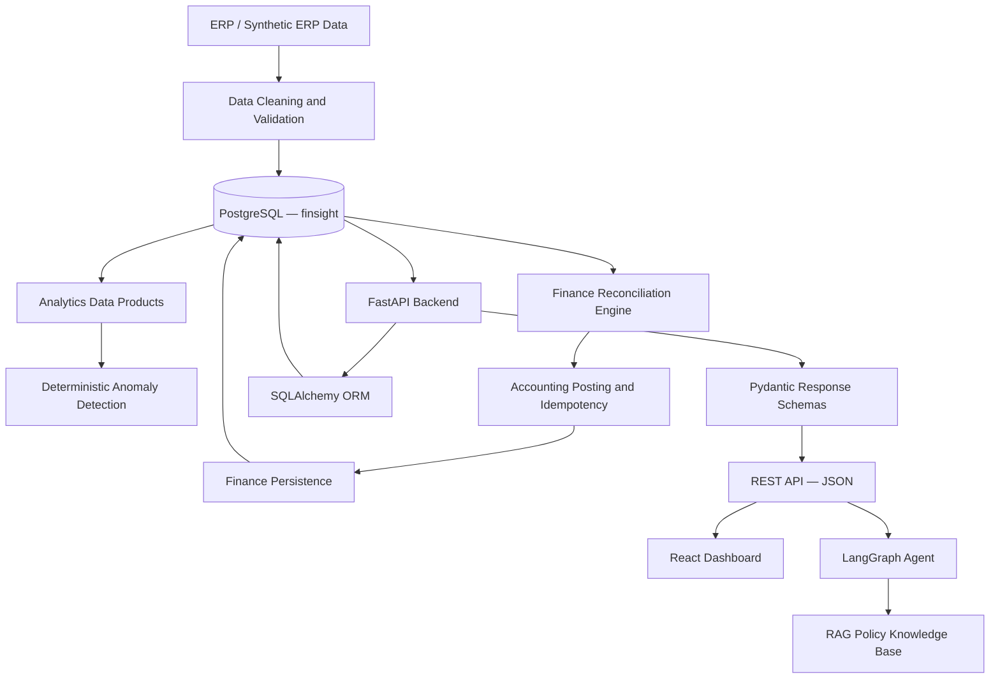
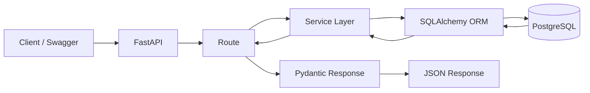
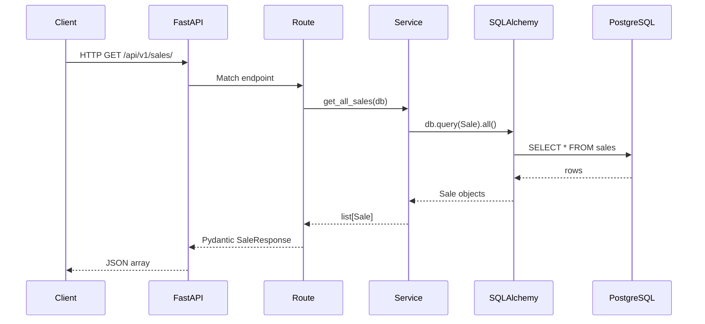
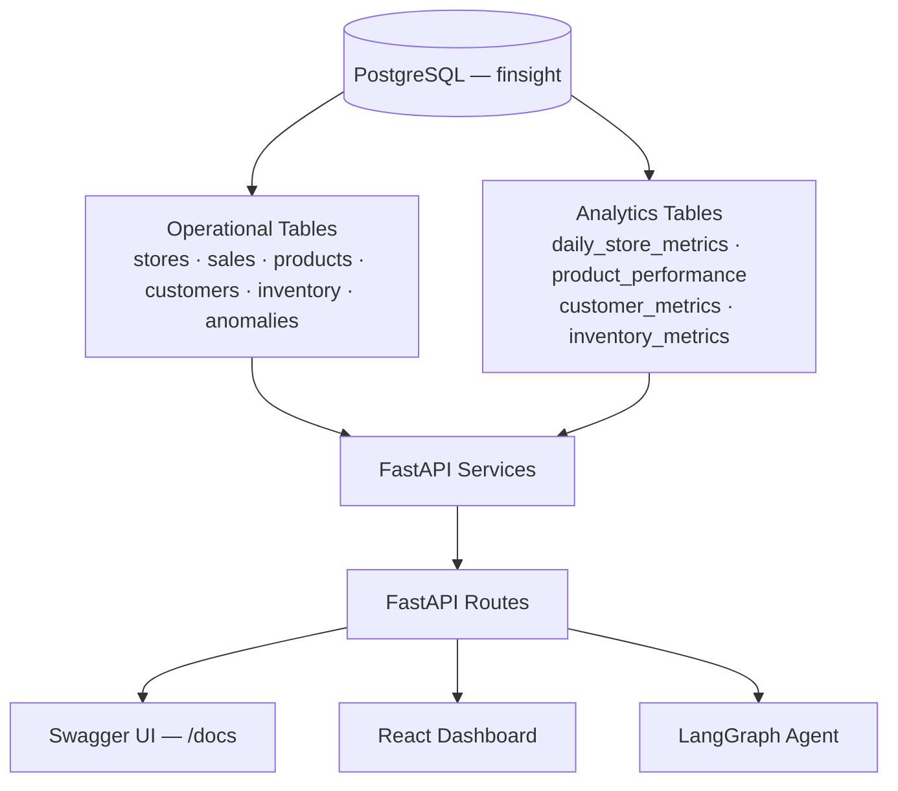
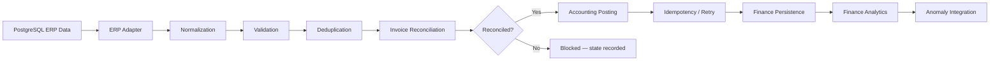
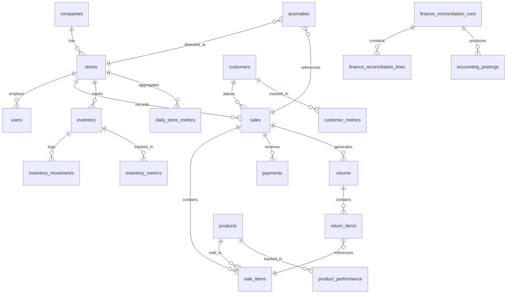

# FinSightAI

**FinSightAI is an AI-powered Finance & Reconciliation Intelligence Platform that combines structured ERP-style business data, a PostgreSQL database, a deterministic finance reconciliation engine, a FastAPI REST backend, and a LangGraph/Groq-powered AI Copilot for grounded decision support.**


---

## 1. Problem Statement

Retail and finance teams generate large volumes of operational data across sales, inventory, payments, returns, expenses, and customer activity. The challenge is not simply querying that data — it is building a system where:

- Raw ERP data is validated and cleaned before it enters any calculation
- Financial reconciliation is deterministic and auditable, not estimated by an LLM
- Anomalies are detected by explicit rules against verified database results
- A REST API exposes structured data to downstream consumers
- AI reasoning is grounded in tool-verified facts (powered by LangGraph and Groq) rather than invented numbers

FinSightAI is built around this principle: **deterministic data pipeline and API first, AI reasoning second.**

---

## 2. Key Features

### Implemented

**PostgreSQL database — 33 tables**
- Operational: companies, stores, users, customers, products, categories, suppliers, supplier_products, inventory, inventory_movements, sales, sale_items, payments, returns, return_items, refunds, expenses, login_events
- Analytics data products: daily_store_metrics, product_performance, customer_metrics, inventory_metrics
- Anomaly detection: anomalies table with rule-based detection (SALES_SPIKE, LOW_STOCK_WITH_DEMAND, FINANCE_FIELDS_INCOMPLETE, and others)
- Finance persistence: finance_reconciliation_runs, finance_reconciliation_lines, accounting_postings
- AI/action scaffolding: ai_insights (and more), action_items, automation_runs, system_logs, audit_logs

**FastAPI backend (`backend/`)**
- 11 live GET endpoints serving operational and analytical data
- Layered architecture: routes → services → SQLAlchemy ORM → PostgreSQL → Pydantic response
- `pydantic-settings` configuration reading from `.env`
- Dependency-injected `get_db()` session per request
- Automatic OpenAPI/Swagger documentation at `/docs`
- All endpoints are read-only at this stage

**Finance reconciliation engine (`finops/`)**
- `Decimal` arithmetic throughout — no binary floating point for money
- Money parsing: plain decimal, Indian grouping, `Rs.` prefix, parenthesized negatives, trailing-minus negatives
- Date normalization: `DD-MM-YYYY`, `DD/MM/YYYY`, `YYYY-MM-DD`
- Duplicate line detection: identical duplicates deduplicated; conflicting duplicates rejected
- Invoice-level validation: partial invoices are never posted
- Reconciliation tolerance: `0.05 × number_of_lines`
- Accounting API client: 201 success, 409 idempotent success, 422 permanent failure, 500/503/timeout retryable — max 3 attempts
- Idempotency key per invoice, reused across retries
- Crash-safe ledger and journal writes using `os.replace`
- Full persistence to PostgreSQL: runs, lines, and postings

**Anomaly detection**
- 32 `SALES_SPIKE` anomalies (daily sales > 2× store average)
- 23 `LOW_STOCK_WITH_DEMAND` anomalies
- 350 `FINANCE_FIELDS_INCOMPLETE` anomalies (returns missing tax fields)
- All anomalies are rule-based, deterministic, and traceable to source records
- Idempotent re-runs insert 0 duplicates

**Data pipeline**
- Synthetic ERP dataset: 5 stores, 1,000 customers, 240 products
- 5,000 cleaned sales, 15,067 sale items, 350 returns, 4,854 payments
- Duplicate invoice `INV-000151` identified and removed from processed data only — raw files preserved
- Product/category mismatch documented as a source data quality issue, not silently corrected

**Test suite**
- 34 tests, 5 subtests, 0 failures
- Covers: money parsing, date parsing, sign validation, deduplication, reconciliation tolerance, partial invoice rejection, API retry/idempotency, ERP adapter traceability, finance integration, PostgreSQL persistence (mocked)

### In Progress

- FastAPI routes for `payments`, `returns`, `refunds`, `expenses` — models and schemas exist but routes are not yet registered in `main.py`
- `backend/app/core/dependencies.py` — placeholder, not yet implemented
- `backend/app/core/security.py` — placeholder, not yet implemented
- `backend/app/routes/auth.py` — placeholder, not yet implemented
- `backend/app/services/auth_service.py` — placeholder, not yet implemented
- `backend/tests/` — test files exist but are empty
- Finance endpoint group (`/api/v1/finance/...`) — finance analytics data is in PostgreSQL but not yet exposed via FastAPI

### Implemented (mostly)

- Authentication and authorization (JWT or session-based)
- Pagination, filtering, and sorting on all list endpoints
- Finance API endpoints: reconciliation runs, blocked returns, posting status
- RAG policy knowledge base
- LangGraph agent layer: Finance & Reconciliation Copilot
- React dashboard consuming the FastAPI backend

---

## 3. Architecture

### System Overview


```mermaid
flowchart TD
    A[ERP / Synthetic ERP Data] --> B[Data Cleaning and Validation]
    B --> C[(PostgreSQL — finsight)]
    C --> D[Analytics Data Products]
    D --> E[Deterministic Anomaly Detection]
    C --> F[Finance Reconciliation Engine]
    F --> G[Accounting Posting and Idempotency]
    G --> H[Finance Persistence]
    H --> C
    C --> I[FastAPI Backend]
    I --> J[SQLAlchemy ORM]
    J --> C
    I --> K[Pydantic Response Schemas]
    K --> L[REST API — JSON]
    L --> M[React Dashboard]
    L --> N[LangGraph Agent]
    N --> O[RAG Policy Knowledge Base]
```

> Components without "Implemented (mostly)" label are implemented. Implemented (mostly) components have directory scaffolding only.

---

### FastAPI Request Flow


```mermaid
flowchart LR
    A[Client / Swagger] --> B[FastAPI]
    B --> C[Route]
    C --> D[Service Layer]
    D --> E[SQLAlchemy ORM]
    E --> F[(PostgreSQL)]
    F --> E
    E --> D
    D --> C
    C --> G[Pydantic Response]
    G --> H[JSON Response]
```

---

### Request Lifecycle


```mermaid
sequenceDiagram
    participant C as Client
    participant F as FastAPI
    participant R as Route
    participant S as Service
    participant ORM as SQLAlchemy
    participant DB as PostgreSQL

    C->>F: HTTP GET /api/v1/sales/
    F->>R: Match endpoint
    R->>S: get_all_sales(db)
    S->>ORM: db.query(Sale).all()
    ORM->>DB: SELECT * FROM sales
    DB-->>ORM: rows
    ORM-->>S: Sale objects
    S-->>R: list[Sale]
    R-->>F: Pydantic SaleResponse
    F-->>C: JSON array
```

---

### Database to API Flow


```mermaid
flowchart TD
    DB[(PostgreSQL — finsight)]
    DB --> OP[Operational Tables\nstores · sales · products · customers · inventory · anomalies]
    DB --> AN[Analytics Tables\ndaily_store_metrics · product_performance\ncustomer_metrics · inventory_metrics]
    OP --> SVC[FastAPI Services]
    AN --> SVC
    SVC --> RT[FastAPI Routes]
    RT --> SW[Swagger UI — /docs]
    RT --> FE[React Dashboard]
    RT --> AI[LangGraph Agent]
```

---

### Finance Reconciliation Flow


```mermaid
flowchart LR
    A[PostgreSQL ERP Data] --> B[ERP Adapter]
    B --> C[Normalization]
    C --> D[Validation]
    D --> E[Deduplication]
    E --> F[Invoice Reconciliation]
    F --> G{Reconciled?}
    G -- Yes --> H[Accounting Posting]
    G -- No --> I[Blocked — state recorded]
    H --> J[Idempotency / Retry]
    J --> K[Finance Persistence]
    K --> L[Finance Analytics]
    L --> M[Anomaly Integration]
```

---

## 4. FastAPI Backend

FinSightAI exposes PostgreSQL-backed operational and analytical data through a layered FastAPI backend. Every request passes through a consistent stack: route → service → SQLAlchemy ORM → PostgreSQL → Pydantic response schema → JSON.

The current API layer is **read-only**. All implemented endpoints are GET requests. POST, PUT, PATCH, and DELETE are not currently implemented.

### Application Entry Point

`backend/app/main.py` creates the FastAPI application instance, registers all routers, and exposes the `/health` endpoint.

### Layer Responsibilities

| Layer | File(s) | Responsibility |
|---|---|---|
| Application | `main.py` | Creates FastAPI app, registers routers, exposes `/health` |
| Routes | `routes/` | Defines HTTP endpoints, injects `get_db()` session, calls services |
| Services | `services/` | Contains database query logic, keeps it out of routes |
| Models | `models/` | SQLAlchemy ORM table representations |
| Schemas | `schemas/` | Pydantic v2 response models — validate and serialize API output |
| Engine | `database/connection.py` | Creates SQLAlchemy engine from settings |
| Session | `database/session.py` | Creates `SessionLocal`, provides `get_db()` dependency |
| Config | `core/config.py` | Reads `DB_HOST`, `DB_PORT`, `DB_NAME`, `DB_USER`, `DB_PASSWORD` from `.env` via `pydantic-settings` |

---

## 5. API Reference

The FastAPI server exposes automatic interactive documentation at `/docs` (Swagger UI) and `/redoc`.

All current endpoints are read-only GET requests. The API returns JSON arrays of objects.

### Health

| Method | Endpoint | Description |
|---|---|---|
| GET | `/health` | Returns `{"status": "ok", "service": "FinSight API"}` |

- Route: `main.py` (inline)
- No database access

### Operational Endpoints

| Method | Endpoint | Route file | Service | Model | Schema | Returns |
|---|---|---|---|---|---|---|
| GET | `/api/v1/stores/` | `routes/stores.py` | `store_service.get_all_stores` | `Store` → `stores` | `StoreResponse` | All stores ordered by `store_id` |
| GET | `/api/v1/sales/` | `routes/sales.py` | `sale_service.get_all_sales` | `Sale` → `sales` | `SaleResponse` | All sales ordered by `sale_id` |
| GET | `/api/v1/products/` | `routes/products.py` | `product_service.get_all_products` | `Product` → `products` | `ProductResponse` | All products ordered by `product_id` |
| GET | `/api/v1/customers/` | `routes/customers.py` | `customer_service.get_all_customers` | `Customer` → `customers` | `CustomerResponse` | All customers ordered by `customer_id` |
| GET | `/api/v1/inventory/` | `routes/inventory.py` | `inventory_service.get_all_inventory` | `Inventory` → `inventory` | `InventoryResponse` | All inventory records ordered by `inventory_id` |
| GET | `/api/v1/anomalies/` | `routes/anomalies.py` | `anomaly_service.get_all_anomalies` | `Anomaly` → `anomalies` | `AnomalyResponse` | All anomalies ordered by `anomaly_id` |

### Analytics Endpoints

| Method | Endpoint | Route file | Service | Model | Schema | Returns |
|---|---|---|---|---|---|---|
| GET | `/api/v1/analytics/daily-store/` | `routes/daily_store_metrics.py` | `daily_store_metric_service.get_all_daily_store_metrics` | `DailyStoreMetric` → `daily_store_metrics` | `DailyStoreMetricResponse` | Daily store metrics ordered by `metric_date` desc, `store_id` |
| GET | `/api/v1/analytics/product-performance/` | `routes/product_performance.py` | `product_performance_service.get_all_product_performance` | `ProductPerformance` → `product_performance` | `ProductPerformanceResponse` | Product performance ordered by `metric_date` desc, `product_id` |
| GET | `/api/v1/analytics/customer-metrics/` | `routes/customer_metrics.py` | `customer_metric_service.get_all_customer_metrics` | `CustomerMetric` → `customer_metrics` | `CustomerMetricResponse` | Customer metrics ordered by `metric_date` desc, `customer_id` |
| GET | `/api/v1/analytics/inventory-metrics/` | `routes/inventory_metrics.py` | `inventory_metric_service.get_all_inventory_metrics` | `InventoryMetric` → `inventory_metrics` | `InventoryMetricResponse` | Inventory metrics ordered by `metric_date` desc, `inventory_id` |

### Response Schema Fields

**StoreResponse**: `store_id`, `company_id`, `store_name`, `city`, `state`, `address`, `created_at`

**SaleResponse**: `sale_id`, `store_id`, `customer_id`, `user_id`, `invoice_number`, `sale_date`, `subtotal`, `discount_amount`, `tax_amount`, `total_amount`, `status`

**ProductResponse**: `product_id`, `category_id`, `product_name`, `sku`, `unit_price`, `cost_price`, `is_active`, `created_at`

**CustomerResponse**: `customer_id`, `full_name`, `email`, `phone`, `city`, `state`, `created_at`

**InventoryResponse**: `inventory_id`, `store_id`, `product_id`, `quantity`, `reorder_level`, `last_updated`

**AnomalyResponse**: `anomaly_id`, `store_id`, `product_id`, `sale_id`, `anomaly_type`, `severity`, `description`, `detected_value`, `expected_value`, `detection_method`, `status`, `detected_at`, `resolved_at`

**DailyStoreMetricResponse**: `metric_id`, `store_id`, `metric_date`, `total_sales`, `total_orders`, `total_returns`, `total_expenses`, `net_sales`, `created_at`

**ProductPerformanceResponse**: `performance_id`, `product_id`, `metric_date`, `units_sold`, `revenue`, `units_returned`, `return_amount`, `created_at`

**CustomerMetricResponse**: `metric_id`, `customer_id`, `metric_date`, `total_orders`, `total_spent`, `total_items_purchased`, `total_returns`, `total_refund_amount`, `created_at`

**InventoryMetricResponse**: `metric_id`, `inventory_id`, `metric_date`, `opening_quantity`, `closing_quantity`, `units_sold`, `units_received`, `units_returned`, `stock_value`, `reorder_level`, `stock_status`, `created_at`

---

## 6. Swagger UI

FastAPI automatically generates interactive OpenAPI documentation from the route and schema definitions.

```
http://127.0.0.1:8000/docs    — Swagger UI
http://127.0.0.1:8000/redoc   — ReDoc
```

To test an endpoint in Swagger UI:
1. Open `http://127.0.0.1:8000/docs`
2. Click an endpoint to expand it
3. Click **Try it out**
4. Click **Execute**
5. Inspect the response body, status code, and headers

---

## 7. HTTP Methods and Status Codes

### HTTP Methods

| Method | Purpose |
|---|---|
| GET | Read / fetch data |
| POST | Create a new resource |
| PUT | Replace / fully update a resource |
| PATCH | Partially update a resource |
| DELETE | Delete a resource |

FinSightAI currently implements read-oriented GET endpoints only. POST, PUT, PATCH, and DELETE are not currently implemented.

### Common HTTP Status Codes

| Code | Meaning |
|---|---|
| 200 | OK — request succeeded |
| 201 | Created — resource successfully created |
| 204 | No Content — success with no response body |
| 400 | Bad Request — malformed request |
| 401 | Unauthorized — authentication required |
| 403 | Forbidden — authenticated but not permitted |
| 404 | Not Found — resource does not exist |
| 422 | Unprocessable Entity — validation error (FastAPI returns this for invalid request data) |
| 500 | Internal Server Error — unexpected server failure |

Not all of these are currently returned by FinSightAI. FastAPI returns 200 on successful GET responses and 422 on request validation failures automatically.

---

## 8. Database Schema

33 tables across 5 logical groups.

| Group | Tables |
|---|---|
| Reference | companies, stores, users, categories, products, suppliers, supplier_products, customers |
| Operational | inventory, inventory_movements, sales, sale_items, payments, returns, return_items, refunds, expenses, login_events |
| Analytics | daily_store_metrics, product_performance, customer_metrics, inventory_metrics |
| Finance | finance_reconciliation_runs, finance_reconciliation_lines, accounting_postings |
| AI / Audit | anomalies, ai_insights, action_items, automation_runs, system_logs, audit_logs, raw_data_batches, raw_sales, data_quality_issues |


```mermaid
erDiagram
    companies ||--o{ stores : has
    stores ||--o{ users : employs
    stores ||--o{ sales : records
    stores ||--o{ inventory : tracks
    stores ||--o{ daily_store_metrics : aggregates
    sales ||--o{ sale_items : contains
    sales ||--o{ payments : receives
    sales ||--o{ returns : generates
    returns ||--o{ return_items : contains
    return_items }o--|| sale_items : references
    products ||--o{ sale_items : sold_in
    products ||--o{ product_performance : tracked_in
    customers ||--o{ sales : places
    customers ||--o{ customer_metrics : tracked_in
    inventory ||--o{ inventory_movements : logs
    inventory ||--o{ inventory_metrics : tracked_in
    finance_reconciliation_runs ||--o{ finance_reconciliation_lines : contains
    finance_reconciliation_runs ||--o{ accounting_postings : produces
    anomalies }o--|| stores : detected_at
    anomalies }o--|| sales : references
```

---

## 9. Technology Choices

| Decision | Choice | Reason |
|---|---|---|
| Database | PostgreSQL | Relational integrity, FK constraints, transactions, `NUMERIC` for money — essential for financial data |
| ORM | SQLAlchemy | Standard Python ORM; clean model-to-table mapping; works with FastAPI dependency injection |
| API framework | FastAPI | Async-capable, automatic OpenAPI docs, Pydantic integration, type-safe |
| Schema validation | Pydantic v2 | Strict type validation on API responses; `from_attributes=True` for ORM compatibility |
| Settings management | pydantic-settings | Reads environment variables from `.env`; type-safe configuration |
| ASGI server | Uvicorn | Production-grade ASGI server for FastAPI |
| Finance arithmetic | Python `Decimal` | Exact decimal arithmetic; binary float is unsuitable for money calculations |
| Direct DB access (finops) | psycopg2 | Finance engine predates the ORM layer; full control over queries; no abstraction hiding financial logic |
| Agent framework | LangGraph | Explicit graph-based control flow |
| Policy retrieval | RAG | Business policies belong in documents, not hardcoded prompts |
| Dashboard | React | Fast analytics UI |

---

## 10. Project Metrics

| Metric | Value |
|---|---|
| Database tables | 33 |
| Stores | 5 |
| Customers | 1,000 |
| Products | 240 |
| Cleaned sales | 5,000 |
| Sale items | 15,067 |
| Returns | 350 |
| Payments | 4,854 |
| Reconciled invoices | 4,854 |
| Total anomalies | 405 |
| FastAPI endpoints | 11 |
| SQLAlchemy models | 10 |
| Pydantic schemas | 10 |
| Tests | 34 passed, 0 failed |

---

## 11. Quick Start

### Prerequisites

- Python 3.12
- PostgreSQL 15 running locally
- A database named `finsight` created in PostgreSQL

```bash
# 1. Clone
git clone https://github.com/OjusGupta/Finsight.git
cd Finsight

# 2. Virtual environment
python -m venv .venv
.venv\Scripts\activate        # Windows
# source .venv/bin/activate   # macOS/Linux

# 3. Install dependencies
pip install -r requirements.txt

# 4. Configure environment
cp .env.example .env
# Edit .env with your PostgreSQL credentials

# 5. Run schema migrations
# In psql: \i database/schema/001_initial_schema.sql
#          \i database/schema/002_finance_persistence.sql

# 6. Load reference and operational data
python scripts/seed_database.py
python scripts/load_remaining_database.py

# 7. Run the test suite
python -m pytest tests/ -v

# 8. Start the FastAPI server
uvicorn backend.app.main:app --reload
# API available at http://localhost:8000
# Swagger UI at http://localhost:8000/docs
```

### Environment Variables

Copy `.env.example` to `.env` and fill in your values. Never commit `.env`.

```
DB_HOST=localhost
DB_PORT=5432
DB_NAME=finsight
DB_USER=postgres
DB_PASSWORD=your_password_here
```

### Finance Engine CLI

The finance reconciliation engine runs independently of the FastAPI server:

```bash
python pipeline.py \
  --lines path/to/lines.csv \
  --customers path/to/customers.csv \
  --run-date 2026-09-24
```

---

## 12. Repository Layout

```
backend/
  app/
    core/
      config.py           pydantic-settings — reads DB credentials from .env
      dependencies.py     placeholder
      security.py         placeholder
    database/
      connection.py       SQLAlchemy engine (postgresql+psycopg2)
      session.py          SessionLocal + get_db() dependency
    models/               SQLAlchemy ORM models (10 implemented)
    routes/               FastAPI route handlers (10 implemented)
    schemas/              Pydantic v2 response schemas (10 implemented)
    services/             Database query layer (10 implemented)
    main.py               FastAPI app, router registration, /health

finops/                   Finance reconciliation engine (pure Python, psycopg2)
  models.py               Dataclasses: NormalizedLine, InvoiceDocument, AccountingResponse
  parsing.py              Date and money parsing
  validation.py           Line-level validation rules
  deduplication.py        Duplicate line detection
  reconciliation.py       Invoice-level reconciliation
  posting.py              PostingEngine with retry and idempotency
  accounting_client.py    AccountingClient interface
  mock_accounting.py      Mock client for testing
  erp_adapter.py          Read-only PostgreSQL ERP adapter
  postgres_persistence.py Finance run/line/posting persistence
  finance_analytics.py    Analytics queries over finance tables
  phase4.py               Live pipeline entry point (ERP → reconcile → post → persist)
  phase5.py               Finance analytics and anomaly integration entry point
  pipeline.py             CLI entry point for CSV-based pipeline

database/
  schema/                 001_initial_schema.sql, 002_finance_persistence.sql
  queries/                finance.sql (12 analytics queries), analytics.sql, sales.sql, inventory.sql
  seeds/                  001_sample_data.sql

scripts/                  Data loading and cleaning scripts
tests/                    34-test suite (pure Python, no DB connection required)
data/                     Raw, processed, reference, and quality CSV data
docs/                     14 documentation files covering all phases
ai/                       LangGraph agent integration
frontend/                 React frontend application
```

---

## 13. Design Principles

1. PostgreSQL is the source of truth.
2. Financial calculations are deterministic — SQL and Python `Decimal`, not LLMs.
3. Raw source data is never silently modified.
4. AI responses must be grounded in tool/database results, not generated numbers.
5. Idempotency matters for every financial operation.
6. Every anomaly must be traceable to its source record.
7. Business logic belongs in services, not in routes or UI.
8. Implemented (mostly) components are clearly labelled as planned.

---

## 14. Roadmap

| Phase | Description | Status |
|---|---|---|
| 1–2 | Project foundation, ERP dataset, data pipeline | ✅ Complete |
| 3 | PostgreSQL schema and operational data loading | ✅ Complete |
| 4 | Analytics data products and anomaly detection | ✅ Complete |
| 5 | Finance reconciliation engine, persistence, analytics | ✅ Complete |
| 6 | FastAPI backend — 11 live GET endpoints | ✅ Complete |
| 6+ | Auth, pagination, finance endpoints, backend tests | 🔄 In Progress |
| 7 | RAG policy knowledge base | ✅ Complete |
| 8 | LangGraph Copilot | ✅ Complete |
| 9 | React dashboard | ✅ Complete |

---

## 15. Documentation

| Document | Purpose |
|---|---|
| [01 Project Overview](docs/01_project_overview.md) | Goals, scope, and context |
| [02 Architecture](docs/02_architecture.md) | Layer responsibilities and design decisions |
| [03 Database Design](docs/03_database_design.md) | Schema, relationships, and constraints |
| [04 Data Pipeline](docs/04_data_pipeline.md) | Raw → processed → database flow |
| [05 Data Quality](docs/05_data_quality_and_fixes.md) | Source issues identified and handled |
| [06 Data Products](docs/06_data_products.md) | Analytics tables and validation |
| [07 Database Loading](docs/07_database_loading.md) | Loader scripts and source mappings |
| [08 Verification](docs/08_verification_and_validation.md) | Reconciliation checks and validation results |
| [09 AI Agent Design](docs/09_ai_agent_design.md) | Agent architecture |
| [10 API Design](docs/10_api_design.md) | FastAPI endpoint design |
| [11 Development Log](docs/11_development_log.md) | Phase-by-phase engineering diary |
| [12 Next Steps](docs/12_next_steps.md) | Current state and upcoming phases |
| [13 Finance Reconciliation Engine](docs/13_finance_reconciliation_engine.md) | Engine design, rules, and live results |
| [14 Finance Analytics](docs/14_phase5_finance_analytics.md) | Phase 5 analytics and anomaly integration |
