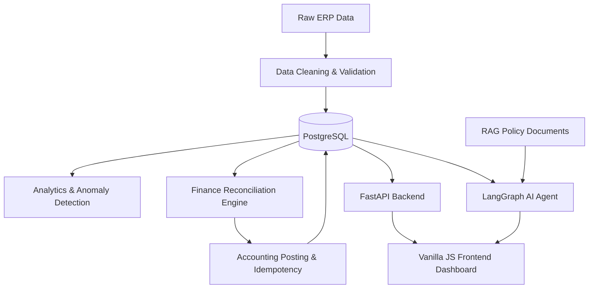
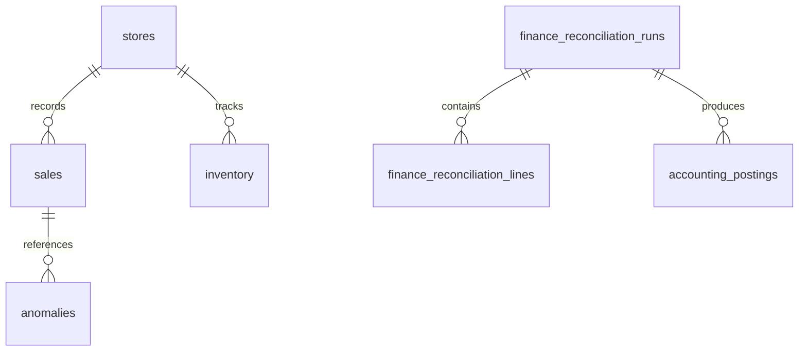

# FinSightAI

FinSightAI is an AI-powered Finance & Reconciliation Intelligence Platform that emphasizes a deterministic data pipeline, strict financial reconciliation rules, and an AI Copilot that only reasons over verified database results.

---

## Overview

FinSightAI solves the problem of unreliable AI financial reporting by separating deterministic transaction processing from AI reasoning. It processes raw ERP data (sales, inventory, returns, payments) through a strict, rule-based finance reconciliation engine. Only after data is validated, reconciled, and persisted to PostgreSQL does the AI layer (powered by LangGraph) interact with it to provide grounded decision support and anomaly explanations.

**Current Supported Capabilities:**
- Full ERP data loading and anomaly detection.
- A deterministic finance reconciliation engine handling decimal-exact arithmetic, duplicates, and idempotent ledger postings.
- A read-only FastAPI backend exposing 13 operational and analytical data endpoints.
- A LangGraph-powered AI Copilot that uses Retrieval-Augmented Generation (RAG) and tool calling to answer finance and reconciliation queries.
- A lightweight, framework-free Vanilla JS / HTML dashboard.

---

## Key Features

### Implemented
- **PostgreSQL Database**: Schema defined for 34 tables (reference, operational, analytics, finance, audit).
- **FastAPI Backend**: Layered architecture (Routes → Services → SQLAlchemy ORM → PostgreSQL) exposing 13 functional read-only GET endpoints.
- **Finance Reconciliation Engine**: A pure-Python deterministic pipeline handling decimal arithmetic, duplicate detection, partial invoice rejection, idempotency, and PostgreSQL persistence.
- **Data Pipeline**: Synthetic ERP dataset ingestion, data cleaning, and validation.
- **Anomaly Detection**: Rule-based generation of `SALES_SPIKE`, `LOW_STOCK_WITH_DEMAND`, and `FINANCE_FIELDS_INCOMPLETE` anomalies.
- **AI Copilot (LangGraph)**: An agentic workflow connected to real-time finance tools that answers specific reconciliation queries using verified metrics.
- **RAG Knowledge Base**: Embeds business policies (e.g., `reconciliation_policy.md`, `anomaly_handling_policy.md`) to ground AI explanations without hallucinating rules.
- **Vanilla Frontend**: A lightweight HTML/CSS/Vanilla JS dashboard serving operational KPIs and the AI chat interface (zero build step).
- **Test Suite**: 44 passing tests covering money parsing, validation, idempotency, AI schemas, and RAG components.

### Partially Implemented
- **Authentication**: JWT authentication exists via `/api/v1/auth/login` but currently relies on a hardcoded demo user rather than the PostgreSQL `users` table.

### Planned
- **Write APIs**: POST/PUT/DELETE endpoints for operational data.
- **Full ORM Coverage**: SQLAlchemy models for `payments`, `returns`, `refunds`, `expenses`, `suppliers`, and `categories` are currently scaffolded but empty.
- **React Dashboard**: The previous complex React/Vite dashboard was removed in favor of a simpler Vanilla JS implementation. A full framework-based UI remains a future consideration.

---

## Architecture


```mermaid
flowchart TD
    A[Raw ERP Data] --> B[Data Cleaning & Validation]
    B --> C[(PostgreSQL)]
    C --> D[Analytics & Anomaly Detection]
    C --> E[Finance Reconciliation Engine]
    E --> F[Accounting Posting & Idempotency]
    F --> C
    
    C --> G[FastAPI Backend]
    G --> H[Vanilla JS Frontend Dashboard]
    
    C --> I[LangGraph AI Agent]
    J[RAG Policy Documents] --> I
    I --> H
```

*(Note: All components shown above are currently implemented and functional.)*

---

## Data Pipeline

1. **Raw ERP data**: Ingested via synthetic CSV files.
2. **Cleaning & Validation**: Data is standardized (e.g., date formats, currency symbols).
3. **PostgreSQL**: Clean data is seeded into operational tables.
4. **Analytics**: Aggregated metrics (daily store, product performance) are computed.
5. **Anomaly Detection**: Rule-based scripts flag anomalies (e.g., missing tax fields in returns) and persist them to the `anomalies` table.

**Dataset Statistics:**
- 5 stores
- 1,000 customers
- 240 products
- 5,000 cleaned sales
- 15,067 sale items

---

## Database

The PostgreSQL database is organized into logical layers. While 34 tables are defined in the SQL schema, the FastAPI application currently surfaces the core 13 via SQLAlchemy ORM.

**Core Implemented Tables:**
- **Reference**: `stores`, `products`, `customers`
- **Operational**: `sales`, `inventory`, `anomalies`
- **Analytics**: `daily_store_metrics`, `product_performance`, `customer_metrics`, `inventory_metrics`
- **Finance**: `finance_reconciliation_runs`, `finance_reconciliation_lines`, `accounting_postings`


```mermaid
erDiagram
    stores ||--o{ sales : records
    stores ||--o{ inventory : tracks
    sales ||--o{ anomalies : references
    finance_reconciliation_runs ||--o{ finance_reconciliation_lines : contains
    finance_reconciliation_runs ||--o{ accounting_postings : produces
```

---

## Finance Reconciliation Engine

Located in `finops/`, this engine handles the core financial logic:
- **Decimal-based arithmetic**: Uses Python `Decimal` to avoid floating-point inaccuracies.
- **Date & currency normalization**: Standardizes varied ERP formats.
- **Validation**: Rejects partial invoices and enforces strict sign constraints.
- **Duplicate detection**: Drops exact duplicates and blocks conflicting duplicates.
- **Idempotency**: Generates consistent keys per invoice, allowing safe retries.
- **PostgreSQL persistence**: Records every run, reconciled line, and accounting posting attempt.
- **Finance Analytics**: Exposes real-time reconciliation rates and blocked document counts.

---

## Anomaly Detection

Anomalies are detected via deterministic rules, never by AI estimation.
- **What is detected**: Unusually high sales (`SALES_SPIKE`), low inventory with high demand (`LOW_STOCK_WITH_DEMAND`), and missing mandatory finance fields (`FINANCE_FIELDS_INCOMPLETE`).
- **Storage**: Persisted to the `anomalies` table.
- **Traceability**: Every anomaly includes the specific `store_id`, `product_id`, or `sale_id` that triggered it.

---

## FastAPI Backend

The backend follows a strict layered architecture:
`Routes` → `Services` → `SQLAlchemy` → `PostgreSQL` → `Pydantic`

**Implemented Endpoints (Read-Only):**
- `/health`
- `/api/v1/stores/`
- `/api/v1/sales/`
- `/api/v1/products/`
- `/api/v1/customers/`
- `/api/v1/inventory/`
- `/api/v1/anomalies/`
- `/api/v1/analytics/daily-store/`
- `/api/v1/analytics/product-performance/`
- `/api/v1/analytics/customer-metrics/`
- `/api/v1/analytics/inventory-metrics/`
- `/api/v1/finance/summary/latest`
- `/api/v1/finance/blocked`

---

## AI / LangGraph

The FinSightAI Copilot is a fully integrated LangGraph agent located in `backend/app/ai/`.

- **Implementation**: Fully functional graph (`StateGraph`) connecting a Groq-powered LLM (`openai/gpt-oss-20b`) to finance tools.
- **Tools**: The agent has direct tool access to `get_latest_finance_summary`, `get_blocked_finance_documents`, `get_finance_states`, `get_finance_posting_status`, and `get_finance_anomalies`.
- **RAG Integration**: The agent can call `search_knowledge_base` to retrieve chunks from markdown policy documents, ensuring it explains anomalies (like `FINANCE_FIELDS_INCOMPLETE`) using actual company policy.
- **Safety**: The agent cannot invent numbers. It is strictly prompted to use tool results to answer the 6 core reconciliation questions.

---

## RAG (Retrieval-Augmented Generation)

- **Source Documents**: Markdown files located in `docs/knowledge/` (e.g., `reconciliation_policy.md`).
- **Retrieval Method**: TF-IDF based vectorization and cosine similarity chunk retrieval.
- **Integration**: Exposed to the LangGraph agent as a callable tool, allowing the AI to look up internal rules when explaining backend behaviors.

---

## React Dashboard

The frontend is a lightweight, framework-free dashboard located in `frontend/`.
- **Stack**: HTML5, CSS3, Vanilla JavaScript, native `fetch()`.
- **Functionality**: Consumes the FastAPI backend to render KPI cards, data tables, and an interactive AI Copilot chat interface.
- **Integration**: Served directly via FastAPI `StaticFiles` at the root `/` URL. No `npm` or build step is required.

---

## Testing

The test suite is located in `tests/` and executes without requiring a live database connection (using mocks for DB persistence).

- **Execution**: 44 tests passed, 0 failures.
- **Coverage**: Includes RAG loaders, RAG splitters, AI schema validation, ERP adapter money parsing, deduplication rules, reconciliation tolerances, idempotency rules, and phase 4 posting retries.

---

## Technology Stack

| Technology | Purpose |
|---|---|
| Python 3.12 | Core backend language |
| PostgreSQL 15 | Relational database source of truth |
| FastAPI | REST API framework |
| SQLAlchemy | Database ORM |
| Pydantic v2 | API schema validation |
| LangGraph | Agentic AI control flow |
| Groq | High-speed LLM inference provider |
| Vanilla JS / HTML | Frontend dashboard |
| Pytest | Automated testing |

---

## Project Structure

```
FinSightAI/
├── backend/
│   └── app/
│       ├── ai/             # LangGraph agent, tools, RAG, and prompts
│       ├── core/           # Configuration (pydantic-settings)
│       ├── database/       # SQLAlchemy engine and session
│       ├── models/         # SQLAlchemy ORM definitions
│       ├── routes/         # FastAPI endpoints
│       ├── schemas/        # Pydantic response models
│       └── services/       # Database query logic
├── data/                   # Raw and processed CSV datasets
├── database/
│   ├── queries/            # Raw SQL analytics queries
│   ├── schema/             # Core SQL DDL scripts
│   └── seeds/              # Sample data SQL inserts
├── docs/                   # Architecture and development logs
│   └── knowledge/          # Markdown policies for RAG
├── finops/                 # Deterministic finance reconciliation engine
├── frontend/               # Vanilla JS/HTML dashboard files
├── scripts/                # Data cleaning and loading utilities
├── tests/                  # Pytest suite
└── pipeline.py             # Finance engine CLI entry point
```

---

## Quick Start

### Prerequisites
- Python 3.12
- PostgreSQL 15 running locally

### Setup
1. **Clone the repository:**
   ```bash
   git clone https://github.com/OjusGupta/Finsight.git
   cd Finsight
   ```

2. **Set up the virtual environment:**
   ```bash
   python -m venv .venv
   .venv\Scripts\activate        # Windows
   # source .venv/bin/activate   # macOS/Linux
   ```

3. **Install dependencies:**
   ```bash
   pip install -r requirements.txt
   ```

4. **Configure Environment:**
   Copy `.env.example` to `.env` and fill in your PostgreSQL credentials and Groq API key.
   ```bash
   cp .env.example .env
   ```

5. **Database Setup:**
   Create a database named `finsight` in PostgreSQL. Run the SQL scripts in `database/schema/` to build the tables.

6. **Seed Data:**
   Run the data loading scripts to populate the database with the synthetic dataset.
   ```bash
   python scripts/seed_database.py
   python scripts/load_remaining_database.py
   ```

7. **Run the API & Frontend:**
   ```bash
   python -m uvicorn backend.app.main:app --reload
   ```
   - Dashboard: `http://127.0.0.1:8000/`
   - Swagger UI: `http://127.0.0.1:8000/docs`

---

## Environment Variables

The application requires a `.env` file in the root directory.

```
DB_HOST=localhost
DB_PORT=5432
DB_NAME=finsight
DB_USER=postgres
DB_PASSWORD=your_password
GROQ_API_KEY=your_groq_api_key
GROQ_MODEL=openai/gpt-oss-20b
```

---

## Current Project Status

| Component | Status | Notes |
|---|---|---|
| PostgreSQL Schema | ✅ Complete | 34 tables defined in SQL. |
| Data Pipeline | ✅ Complete | Loads synthetic ERP data into DB. |
| Analytics & Anomalies | ✅ Complete | Deterministic rule-based detection active. |
| Finance Engine | ✅ Complete | Full reconciliation and idempotency pipeline. |
| FastAPI | ✅ Complete | 13 read-only GET endpoints implemented. |
| Authentication | 🟡 Partial | Demo user hardcoded via JWT; DB auth not integrated. |
| Pagination/Filtering | ✅ Complete | Integrated into active list endpoints. |
| LangGraph | ✅ Complete | Agent correctly routes to finance tools. |
| RAG | ✅ Complete | Embeds policies for grounded explanations. |
| AI Copilot | ✅ Complete | Answers the core reconciliation inquiries. |
| Vanilla Dashboard | ✅ Complete | Replaced React with a framework-free UI. |
| Tests | ✅ Complete | 44 tests passing. |

---

## Future Roadmap

- **Authentication (🟡 In Progress)**: Connect the JWT login route to the PostgreSQL `users` table.
- **ORM Expansion (🔴 Planned)**: Implement SQLAlchemy models for the remaining operational tables (`payments`, `returns`, `expenses`).
- **Write APIs (🔴 Planned)**: Support POST/PUT operations for manual anomaly resolution.

---

## Design Principles

1. **PostgreSQL as Source of Truth**: All operational and analytical data lives in the database.
2. **Deterministic Financial Calculations**: Handled exclusively via SQL and Python `Decimal`. AI is never used to estimate money.
3. **Idempotent Operations**: All financial postings use consistent keys to safely allow retries.
4. **AI Grounded in Verified Data**: The Copilot relies strictly on tool outputs and RAG retrieval, preventing numerical hallucination.
5. **Traceable Anomalies**: Every flagged issue links deterministically back to a source ERP record.

---

## Limitations

- **Authentication**: Currently relies on a hardcoded demo user.
- **Read-Only API**: Data cannot currently be mutated via the FastAPI endpoints.
- **Empty Models**: Several ORM models exist as empty files and are not yet mapped to the database.
- **UI Scalability**: The Vanilla JS frontend is lightweight but lacks the advanced state management of a full frontend framework for highly complex interactions.
