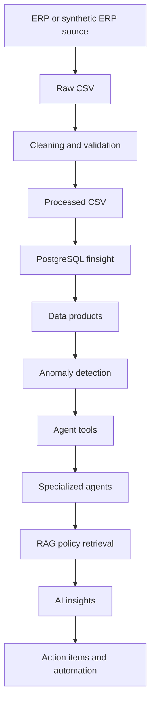

# System Architecture

## End-to-End Architecture



## Layer Responsibilities

### Source and Data Layer

`data/.../raw` contains original source files. `data/.../processed` contains cleaned outputs. `reference` contains master data such as products, stores, and suppliers.

### Cleaning Layer

`scripts/clean_finsight_sales.py` removes the duplicate invoice by keeping the first invoice occurrence and writes processed sales files. It does not overwrite the raw sales files.

### Database Layer

`database/schema/001_initial_schema.sql` defines normalized operational tables, data-quality tables, analytics tables, and planned AI/automation tables. PostgreSQL enforces relationships and nonnegative-value rules.

### Loading Layer

`scripts/seed_database.py` loads reference data and inventory movements. `scripts/load_remaining_database(1).py` loads processed sales and remaining operational data. Loader behavior includes conflict handling and source-to-target mappings.

### Data Product Layer

Data products summarize operational facts at useful grains such as store-day, product-day, customer-day, or inventory-day. Their values can be validated independently of an LLM.

### Anomaly Layer

The schema includes an `anomalies` table. A complete anomaly detector is **To be verified**.

### AI Layer

The `ai/` folders describe intended agents, tools, prompts, RAG, and workflows. Inspected agent files are empty, so the runtime AI layer is planned rather than claimed as complete.

### API and UI Layers

The `backend/` structure is intended for FastAPI. The `frontend/` structure is intended for Streamlit. The inspected entry points are empty; implementation status is **To be verified**.

## Core Principle

```text
SQL/Python/rules -> exact calculations
Agents/LLMs      -> explanation, context, recommendations
```

## Interview Takeaway

- A layered architecture makes responsibilities easier to test.
- Data products create a stable contract between the database and AI.
- RAG adds policy context; it does not replace database queries.
- Planned components must be distinguished from working components.
