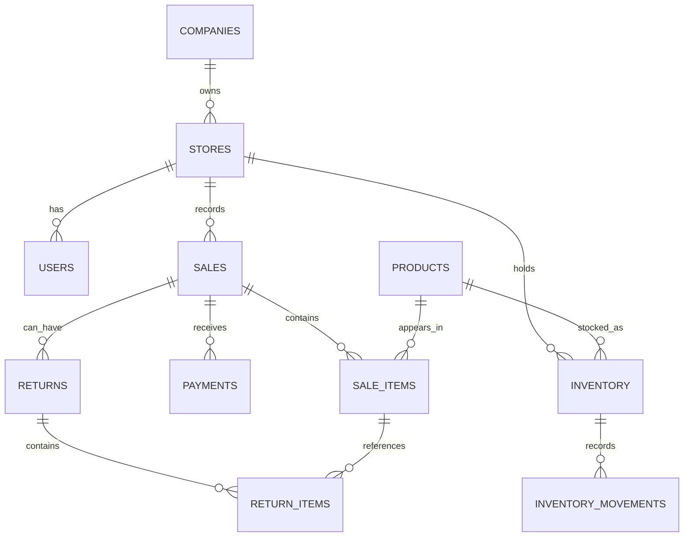

# Database Design

## Why PostgreSQL

PostgreSQL provides tables, relationships, constraints, transactions, and SQL aggregation. These features are useful for ERP data because financial and inventory calculations need consistent, queryable records.

## Database Groups

The project database is `finsight`.

### Core and Operational Tables

`companies`, `stores`, `users`, `categories`, `products`, `suppliers`, `supplier_products`, `customers`, `inventory`, `inventory_movements`, `sales`, `sale_items`, `payments`, `returns`, `return_items`, `refunds`, `expenses`, and `login_events` store master data and business events.

### Ingestion and Analytics Tables

`raw_data_batches`, `raw_sales`, and `data_quality_issues` support ingestion and quality tracking. `daily_store_metrics`, `product_performance`, `customer_metrics`, and `inventory_metrics` are analytics data products.

### AI and Automation Tables

The schema also defines `anomalies`, `ai_insights`, `action_items`, `automation_runs`, and `audit_logs`. Their complete runtime population is **To be verified**.

## Relationship Overview



Important chains:

```text
Company -> Stores -> Users
Store -> Sales -> Sale Items -> Products
Sale -> Payments
Sale -> Returns -> Return Items -> Refunds
Store + Product -> Inventory -> Inventory Movements
```

A return item reaches its product through `return_items.sale_item_id -> sale_items.sale_item_id -> sale_items.product_id`. A return reaches its store through `returns.sale_id -> sales.sale_id -> sales.store_id`.

## Beginner Terms

- A **primary key** uniquely identifies one row, such as `product_id`.
- A **foreign key** points to a row in another table, such as `sales.store_id` pointing to `stores.store_id`.
- A **one-to-many relationship** means one parent can have many child rows.
- A **constraint** is a database rule, such as a nonnegative quantity check.
- A **transaction** groups changes so they can be committed together or rolled back after an error.

## Inventory Detail

The repository schema uses `inventory.last_updated`, not `updated_at`. The raw inventory CSV uses `updated_at`, so the loader maps the source field to the normalized database field. SQL must use the live database column name.

## Decision

**Decision:** Keep operational facts normalized and create separate data products.

**Why:** This reduces repeated source facts and makes metric grain explicit.

**Alternative:** Calculate every dashboard number directly from raw tables.

**Reason:** Reusable data products are easier to validate and reuse.

## Interview Takeaway

- Foreign keys protect relationships between business entities.
- Normalization reduces duplicated facts.
- Analytics tables should document their grain and calculation rules.
- Transactions matter when a failed SQL statement must be rolled back.
