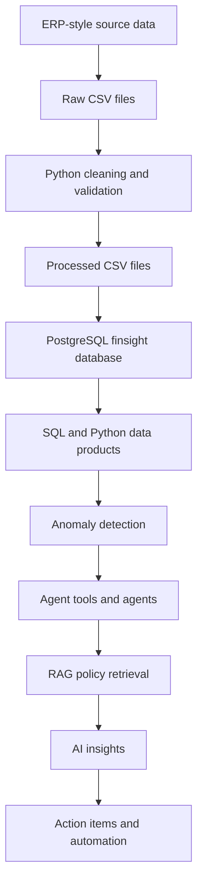

\# FinSight Architecture

## End-to-End Flow

## Layer Responsibilities

| Layer | Responsibility | Repository evidence |
|---|---|---|
| Data | Preserve raw files and create processed copies | `data/`, `scripts/clean_finsight_sales.py` |
| Database | Store normalized operational records and analytics tables | `database/schema/001_initial_schema.sql` |
| Loading | Insert CSV records and handle source-to-target mappings | `scripts/seed_database.py`, `scripts/load_remaining_database(1).py` |
| Analytics | Calculate repeatable metrics with SQL/Python | Data-product work is described in the project validation notes; query files are present |
| AI | Interpret verified data and recommend actions | `ai/` structure exists, but inspected agent files are empty |
| API | Expose application capabilities | `backend/` structure exists, but inspected `main.py` and route files are empty |
| UI | Present dashboards and workflows | `frontend/` structure exists, but inspected entry/page files are empty |

## Design Principle

SQL, Python, and explicit business rules calculate exact numbers. Agents and LLMs should explain those numbers, retrieve relevant policy text, and recommend actions. They should not invent financial totals.

## Current Versus Planned

The CSV cleaning and database loading path is evidenced by repository code. The anomaly, API, dashboard, LangGraph, RAG, and automation layers are planned unless a later implementation adds code.

## Interview Takeaway

- Separate deterministic calculations from probabilistic language-model reasoning.
- Use data products to give downstream systems stable, reusable metrics.
- Keep raw data so cleaning decisions remain auditable.
- Treat each layer as responsible for one kind of work.

